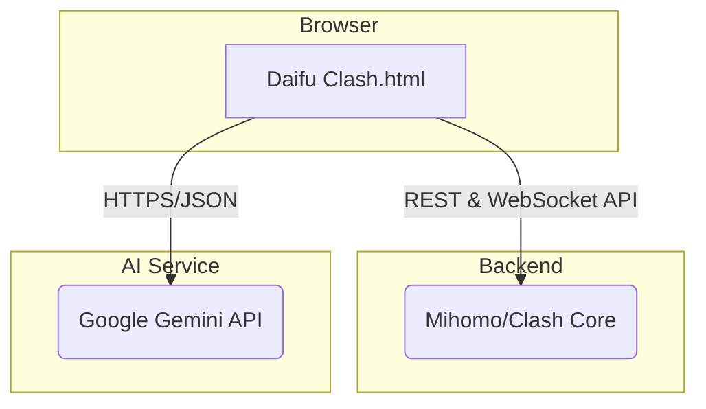

<p align="center">
  
</p>

<h1 align="center">Daifu Clash Dashboard</h1>

<p align="center">
  <strong>一个现代化、由 AI 增强的 Clash 核心 Web 控制面板。</strong>
  <br />
  <i>A modern, AI-enhanced web dashboard for your Clash core.</i>
</p>

<p align="center">
  <a href="#-项目理念">理念</a> •
  <a href="#-功能特性">功能</a> •
  <a href="#-架构">架构</a> •
  <a href="#-部署指南">部署</a> •
  <a href="#-配置">配置</a> •
  <a href="#-发展蓝图">蓝图</a> •
  <a href="#-贡献">贡献</a>
</p>

---

`Daifu Clash Dashboard` 是一个**由AI设计完成的**为 [Clash](https://github.com/Dreamacro/clash) (及兼容核心) 设计的全新 Web 用户界面。尽管 Clash 核心功能强大，但其控制和配置往往需要用户具备一定的专业知识。本项目旨在通过一个美观、直观、且注入了 AI 智能的仪表盘，彻底改变这一现状，让高级网络管理变得前所未有的简单和高效。

我们的设计哲学是**化繁为简，智能洞察**。 无论是日常的节点切换、流量监控，还是复杂的网络问题诊断和规则理解，Daifu Clash 都力求提供最流畅、最智能的解决方案。

本项目是一个纯前端单页面应用 (SPA)，极致轻量，无需编译，下载即用。


## 📋 功能特性 (Features)

### 核心管理功能

| 功能 | 描述 |
| :--- | :--- |
| **实时概览** | 可视化仪表盘，展示实时上下行速度、会话流量统计、总量统计，并附带平滑的流量历史曲线图。 |
| **代理管理** | 清晰地展示策略组和节点，支持一键切换。内置延迟测试工具，可对单个或全部节点进行测试。 |
| **连接监控** | 实时展示所有网络连接，包括来源、目标主机、路由规则、代理链路、速度和流量。支持搜索和关闭连接。 |
| **规则与日志** | 直观地查看所有已加载的路由规则和实时日志流。日志支持按级别（Info, Warning, Error）过滤。 |
| **现代化 UI/UX** | 采用 Tailwind CSS 构建，界面美观现代。支持明/暗主题无缝切换，并内置中/英双语。 |

### ✨ AI 赋能的特色功能

通过在设置中配置您的 Gemini API 密钥，即可解锁一系列由大型语言模型驱动的强大功能。

#### 🧠 AI 连接分析
一键分析当前所有网络连接，AI 会自动将其按用途（如系统服务、社交媒体、广告追踪等）进行分类汇总，并高亮识别已知的广告或追踪域名，让您对后台流量一目了然。

#### 🩺 AI 日志诊断
面对海量日志手足无措？AI 日志诊断功能会智能分析最近的日志流，不仅能总结关键信息，还能识别事件之间的**内在关联**（例如，DNS 解析失败与后续的连接超时），并以结构化报告的形式呈现，帮助您快速定位问题根源。

#### 💡 AI 规则解释器
对复杂的 Clash 规则感到困惑？点击任意规则旁的“解释”按钮，AI 将化身网络专家，用最通俗易懂的语言为您解释该规则的类型、匹配逻辑和最终执行的策略。


## 🏗️ 架构 (Architecture)

Daifu Clash 采用简洁高效的前后端分离架构。



- **前端 (Frontend)**: 纯静态的单 HTML 文件 (`Daifu Clash.html`)，负责所有 UI 渲染和用户交互。
- **后端 (Backend)**: 用户自行部署的 Clash 兼容核心（如 Mihomo），需开启其 `external-controller` API 服务。前端通过此 API 获取状态、管理配置。
- **AI 服务 (AI Service)**: 前端直接与 Google Gemini API 通信，发送分析请求并接收结果。

## 🚀 部署指南 (Deployment)

### Step 1: 后端准备 (Backend Preparation)
确保你有一个正在运行的 Clash 兼容核心，并在其配置文件 `config.yaml` 中启用了 API 服务。
```yaml
# config.yaml
port: 7890
socks-port: 7891
mode: rule
log-level: info

# 关键配置: 开启 API 服务，允许外部访问
external-controller: '0.0.0.0:9090'
# secret: 'your-secret' # 可选，但建议设置

# 可选配置: 让 Clash 核心直接托管 Daifu Clash
# external-ui: 'path/to/daifu-clash-folder'
```

### Step 2: 前端部署 (Frontend Deployment)
选择以下任意一种方式部署前端 HTML 文件。

#### 方式一: 本地服务器 (推荐)
这是最简单且最可靠的方式，可以有效避免浏览器因安全策略导致的 CORS 问题。
1.  下载 `Daifu Clash.html` 文件。
2.  在文件所在目录打开终端，根据你的环境执行命令：
    ```bash
    # 如果你安装了 Python 3
    python -m http.server 8080
    
    # 如果你安装了 Node.js
    npx serve .
    ```
3.  在浏览器中访问 `http://localhost:8080/Daifu Clash.html`。

#### 方式二: Docker 部署
我们提供了一个简单的 `Dockerfile` 来使用 Nginx 托管前端文件，适合容器化环境。
1.  在与 `Daifu Clash.html` 相同的目录下，创建一个名为 `Dockerfile` 的文件：
    ```Dockerfile
    FROM nginx:alpine
    COPY ./"Daifu Clash.html" /usr/share/nginx/html/index.html
    EXPOSE 80
    CMD ["nginx", "-g", "daemon off;"]
    ```
2.  构建并运行 Docker 容器：
    ```bash
    docker build -t daifu-clash .
    docker run -d -p 8080:80 --name daifu-clash-container daifu-clash
    ```
3.  在浏览器中访问 `http://localhost:8080`。

#### 方式三: 生产环境 (Nginx/Caddy)
在生产环境中，建议使用功能完善的 Web 服务器（如 Nginx）来托管，并通过反向代理解决 API 跨域问题。
```nginx
# Nginx 配置示例
server {
    listen 80;
    server_name your.domain.com;

    # 托管前端
    location / {
        root /path/to/your/daifu-clash/folder;
        try_files $uri /Daifu Clash.html;
    }

    # 反向代理到 Clash API，解决跨域
    location /clash-api/ {
        proxy_pass [http://127.0.0.1:9090/](http://127.0.0.1:9090/);
        proxy_http_version 1.1;
        proxy_set_header Upgrade $http_upgrade;
        proxy_set_header Connection "Upgrade";
        proxy_set_header Host $host;
    }
}
```
配置完成后，在 Daifu Clash 设置页面将 API 地址设为 `http://your.domain.com/clash-api`。

## ⚙️ 配置指南 (Configuration)

首次加载应用后，请访问侧边栏的 **设置 (Settings)** 页面完成配置。

| 配置项 | 位置 | 必填 | 默认值 | 描述 |
| :--- | :--- | :--- | :--- | :--- |
| **Mihomo API 地址** | API 设置 | 是 | `http://127.0.0.1:9090` | 你的 Clash 核心 `external-controller` 地址。 |
| **延迟测试 URL** | API 设置 | 否 | `http://www.google.com/...` | 用于测试节点延迟的 URL。 |
| **AI 提供商** | AI 分析设置 | 否 | `Gemini` | 选择用于 AI 功能的语言模型提供商。 |
| **API Key** | AI 分析设置 | 是 (若启用AI) | (空) | 你选择的 AI 提供商的 API 密钥。 |
| **API Base URL** | AI 分析设置 | 否 | (空) | 针对非官方或代理的 AI API 端点。 |
| **Model** | AI 分析设置 | 否 | (空) | 指定要使用的模型名称 (如 `gpt-4-turbo`)。 |
| **主题** | 外观 | 否 | `明亮 (Light)` | 切换明亮或暗黑主题。 |
| **语言** | 外观 | 否 | (浏览器默认) | 切换界面语言 (中/英)。 |

## 📡 后端 API 需求
Daifu Clash 前端依赖于后端 Clash 核心提供以下 API 接口：
- **REST APIs**: `/configs`, `/proxies`, `/proxies/{name}/delay`, `/version`, `/rules`, `/connections`
- **WebSockets**: `/traffic`, `/logs`, `/connections`

## 🗺️ 发展蓝图 (Roadmap)

我们对 Daifu Clash 的未来充满期待，以下是一些计划中的功能：
- [ ] **完整的配置文件管理**：支持在 UI 中直接查看、编辑和切换不同的配置文件。
- [ ] **规则集管理**：允许用户在线更新或修改规则集。
- [ ] **历史数据统计**：记录并展示更长时间维度的流量和延迟数据。
- [ ] **更多 AI 提供商支持**：集成更多 LLM 提供商，如 Anthropic Claude 等。
- [ ] **插件系统**：允许社区开发和集成第三方功能插件。

## 🤝 贡献 (Contributing)

我们热烈欢迎并感谢所有形式的社区贡献。
1.  **报告问题 (Issues)**: 如果你发现了 Bug 或者有新功能的想法，请在 Issues 区提出。
2.  **代码贡献 (Pull Requests)**:
    - Fork 本仓库并从 `main` 分支创建你的特性分支。
    - 确保你的代码遵循项目现有风格。
    - 建议使用符合 [Conventional Commits](https://www.conventionalcommits.org/) 规范的提交信息，例如：
      - `feat: Add AI proxy optimization feature`
      - `fix: Correctly handle API connection errors`
      - `docs: Update README with deployment instructions`
    - 发起 Pull Request 并清晰地描述你的改动。

## 📄 许可证 (License)

本项目基于 [MIT License](./LICENSE) 授权。

## 🙏 致谢 (Acknowledgements)

* **Clash Team**: 感谢他们创造了如此强大的开源网络工具。
* **Mihomo (Clash.Meta) Team**: 感谢其在 Clash 基础上的持续创新。
* **开源社区**: 感谢 Tailwind CSS, Chart.js, Feather Icons 等所有本项目使用的开源库的开发者。

---
注：本 Readme文档由 Gemini 2.5 Pro 完成，如有不正之处请指正。
